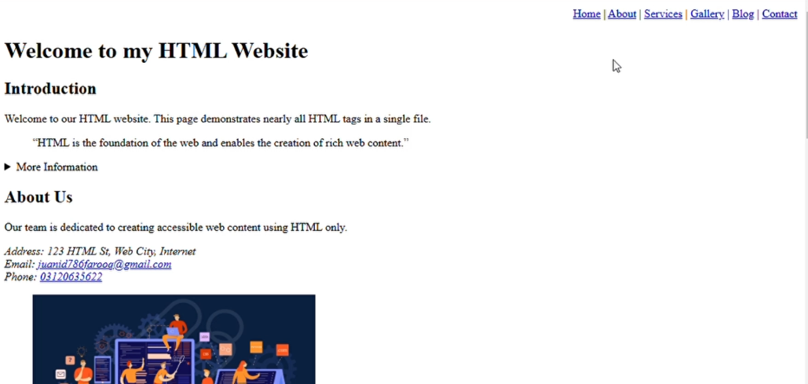

# My First HTML Project  

## Overview  
This is my first HTML project, designed to demonstrate nearly all essential HTML tags in a single file. The project is a fully functional and structured website with various sections, providing a practical learning experience for web development.  

## Features  
- **Navigation Bar:** Links to different sections of the website.  
- **Semantic Tags:** Used to create well-structured and accessible content.  
- **Media Elements:** Images with captions for better context.  
- **Interactive Content:**  
  - A *details* tag for expandable information.  
  - A functional contact form to send messages.  
- **Content Organization:** Tables, lists, and articles for structured presentation.  

## Sections  
1. **Home**: An introduction to the website and its purpose.  
2. **About Us**: Information about the team, contact details, and a team image.  
3. **Services**: A list of offered services with a price table.  
4. **Gallery**: A visual showcase of recent projects and team events.  
5. **Blog**: Articles on topics like HTML and accessible web design.  
6. **Contact Us**: A simple form for users to reach out.  

## Technologies Used  
- HTML5  

## Project Highlights  
- Demonstrates the use of almost every essential HTML tag.  
- Focuses on proper content structure and accessibility.  
- Showcases a combination of static and dynamic elements.  

## How to View the Project  
1. Clone or download this repository.  
2. Open the `index.html` file in any modern web browser.

## Demo

<video src="demo.mp4" controls width="500"></video>

## Contact  
For any feedback or suggestions, feel free to reach out:  
- **Email**: [junaidfarooq.pk@gmail.com](mailto:junaidfarooq.pk@gmail.com)  
- **Phone**: +92 312 0635622  

---

**Thank you for checking out my first project! Your feedback is invaluable to me as I continue to learn and grow.**  
